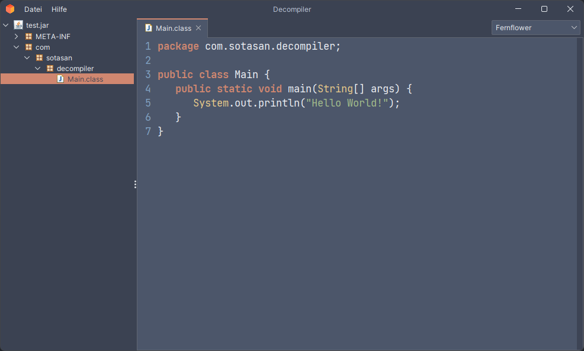

<p align="center">
    <a href="src/test/java/com/sotasan/decompiler/Main.java"></a>
</p>

<p align="center">
    <a href="https://github.com/sotasan/decompiler/tags"></a>
    <a href="https://github.com/sotasan/decompiler/actions/workflows/build.yml"></a>
    <a href="https://github.com/sotasan/decompiler/blob/master/LICENSE"></a>
</p>

# <a href="src/main/resources/logo/logo.svg"></a> Decompiler

A Java-Based GUI application that allows you to browse java archives using various different decompilers.

## Download

To download the application, you can go to the [Releases](https://github.com/sotasan/decompiler/releases) page to either directly download the .jar, or you can obtain the source and [build it yourself](https://github.com/sotasan/decompiler#Build).
The latest release can be found [here](https://github.com/sotasan/decompiler/releases/tag/v0.9.0).

## Usage

To run the program, simply execute the jar file.
Then, you can drag-and-drop any jar you want to decompile and analyze directly onto the program.
From here, you will be able to browse the archive's files using the tree browser on the left.

You can select a decompiler to use by locating the decompiler dropdown in the top right.


If you want to compare different compilers side to side or if you want to analyze multiple jars at once, you can start up a new instance of the application via the File dropdown.

You can zoom in and out of the screen by holding Ctrl then using the scroll wheel.

## Decompilers

The decompiler GUI supports the following decompilers:

- [CFR](https://www.benf.org/other/cfr/) - Another Java Decompiler
- [Procyon](https://github.com/mstrobel/procyon) - A suite of Java metaprogramming tools
- [Vineflower](https://vineflower.org) - Modern Java decompiler aiming to be as accurate as possible

## Languages

The application supports the following languages:

- [English](src/main/resources/langs/language.properties)
- [German](src/main/resources/langs/language_de.properties)
- [French](src/main/resources/langs/language_fr.properties)
- [Japanese](src/main/resources/langs/language_ja.properties)
- [Dutch](src/main/resources/langs/language_nl.properties)
- [Russian](src/main/resources/langs/language_ru.properties)
- [Chinese](src/main/resources/langs/language_zh.properties)

The language is automatically determined by your locale.
To add more languages, you can add new localization files [here](https://github.com/sotasan/decompiler/blob/master/src/main/resources/langs/).

## Build

To build the application from source, make sure you have Java 11+ installed, then just build it with Gradle:

```bash
$ git clone https://github.com/sotasan/decompiler.git
$ cd decompiler
$ chmod +x gradlew
$ ./gradlew build
```

## Contributing

Contributions are welcome!
If you want to report bugs or provide feedback,
you can create an [issue](https://github.com/sotasan/decompiler/issues).
If you would like to contribute directly, 
you can create a [pull request](https://github.com/sotasan/decompiler/pulls).

## License

The application is available under the [BSD 3-Clause](LICENSE) license.