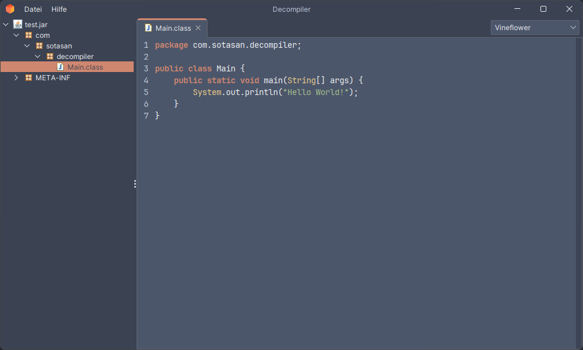

<p align="center">
    
</p>

<h1 align="center">Decompiler</h1>

<p align="center">一个 GUI 应用程序，可使用你选择的反编译器浏览 Java 归档文件。</p>

<p align="center"><a href="README.md">English</a> | <a href="README.de.md">Deutsch</a> | <a href="README.es.md">Español</a> | <a href="README.fr.md">Français</a> | <a href="README.ja.md">日本語</a> | <a href="README.nl.md">Nederlands</a> | <a href="README.ru.md">Русский</a> | 中文</p>

<p align="center">
    <a href="https://github.com/sotasan/decompiler/tags"></a>
    <a href="https://github.com/sotasan/decompiler/actions/workflows/release.yml"></a>
    <a href="LICENSE"></a>
</p>

<p align="center">
    <a href="demo/src/main/java/moe/sota/decompiler/demo/Main.java"></a>
</p>

## 使用方法

从 [releases](https://github.com/sotasan/decompiler/releases) 页面下载最新的 JAR，并使用 Java 25+ 运行：

```bash
java -jar decompiler-x.y.z.jar
```

- **打开归档文件** - `文件 > 打开文件`（`Ctrl/Cmd + O`），或直接拖放到窗口中。
- **切换反编译器** - 使用右上角的下拉框。
- **对比或多任务** - `文件 > 打开新窗口`（`Ctrl/Cmd + N`）会打开一个新窗口，可以并排对比反编译器，或同时浏览多个归档文件。

## 反编译器

支持以下反编译器：

- [CFR](https://github.com/FabricMC/cfr) - 另一个 Java 反编译器
- [JD](https://java-decompiler.github.io) - 又一个快速的 Java 反编译器
- [Procyon](https://github.com/mstrobel/procyon) - 一套 Java 元编程工具
- [Vineflower](https://vineflower.org) - 追求最高准确度的现代 Java 反编译器

## 语言

应用程序会跟随系统区域设置：

[英语](src/main/resources/langs/language.properties) |
[德语](src/main/resources/langs/language_de.properties) |
[西班牙语](src/main/resources/langs/language_es.properties) |
[法语](src/main/resources/langs/language_fr.properties) |
[日语](src/main/resources/langs/language_ja.properties) |
[荷兰语](src/main/resources/langs/language_nl.properties) |
[俄语](src/main/resources/langs/language_ru.properties) |
[中文](src/main/resources/langs/language_zh.properties)

如需添加或改进翻译，请编辑[语言文件](src/main/resources/langs)并发起 [pull request](https://github.com/sotasan/decompiler/pulls)。

## 构建

从源码构建应用程序，只需使用 Gradle：

```bash
git clone https://github.com/sotasan/decompiler.git
cd decompiler
mise install
./gradlew build
```

从源码启动应用程序并预加载演示 JAR：

```bash
./gradlew run
```

## 贡献

发现了 bug 或有想法？欢迎提交 [issue](https://github.com/sotasan/decompiler/issues)。也欢迎 pull request。

## 许可证

基于 [MIT](LICENSE) 许可证发布。
